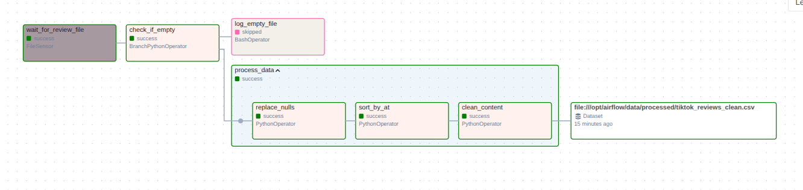
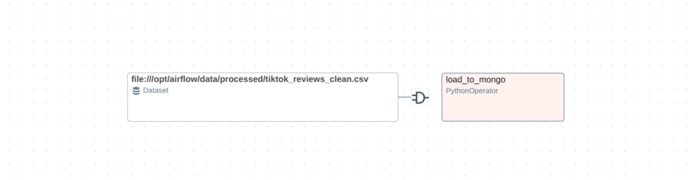

# Airflow practice: TikTok Google Play reviews → MongoDB

Apache Airflow 2.11 pipeline that waits for a CSV of TikTok Google Play reviews, cleans it with Pandas, and loads the result into MongoDB. The second DAG is **data-aware**: it starts when the cleaned file Dataset is updated.

```
archive/tiktok_google_play_reviews.csv
        → copy into data/incoming/
        → FileSensor → Branch (empty vs data)
        → TaskGroup (nulls → sort by `at` → clean `content`)
        → Dataset (tiktok_reviews_clean.csv)
        → DAG 2 insert_many → MongoDB airflow_data.reviews
```

## Prerequisites

- Docker and Docker Compose
- ~4 GB RAM for the Compose stack (LocalExecutor, no Celery worker)
- Optional: [MongoDB Compass](https://www.mongodb.com/try/download/compass)

## Start the stack

From the repo root:

```bash
echo "AIRFLOW_UID=$(id -u)" > .env
docker compose up -d
```

Wait until `airflow-webserver` is healthy, then open http://127.0.0.1:8080

| | |
|---|---|
| UI login | `airflow` / `airflow` |
| MongoDB | `localhost:27017` (no auth) |
| Compass URI | `mongodb://localhost:27017` |

```bash
docker compose ps
curl -sS -o /dev/null -w '%{http_code}\n' http://127.0.0.1:8080/health
```

`health` should return `200`.

Stop:

```bash
docker compose down
```

Volumes keep the Airflow metadata DB and Mongo data. The 77 MB CSV is **not** stored in git.

## Project layout

```
dags/
  process_data_dag.py      # DAG 1: sensor, branch, Pandas TaskGroup, Dataset
  load_to_mongo_dag.py     # DAG 2: Dataset schedule → MongoDB
data/incoming/             # FileSensor watches this folder
data/processed/            # intermediate and final CSV (gitignored)
scripts/log_empty.sh       # empty-file branch
mongo/queries.js           # Compass / mongosh aggregations
archive/                   # local copy of the source CSV (gitignored)
```

Python extras in the image (`requirements.txt`): `pandas`, `pymongo`, `apache-airflow-providers-mongo`.

## Source CSV (do not commit)

Dataset: TikTok Google Play reviews (Kaggle-style). Local file: `archive/tiktok_google_play_reviews.csv` (~77 MB, ~307k rows).

It is listed in `.gitignore`. Put it in `archive/` yourself, then copy into the sensor folder when you run the DAG.

| Column | Role in this project |
|---|---|
| `content` | review text (emojis stripped) |
| `score` | rating 1–5 |
| `at` | created datetime (`created_date` in the assignment) |

Empty / NaN / `"null"` cells are replaced with `"-"`.

## Airflow connection

**Admin → Connections**

| Field | Value |
|---|---|
| Conn Id | `mongo_default` |
| Conn Type | MongoDB |
| Host | `mongo` (Compose service name) |
| Port | `27017` |
| Schema (database) | `airflow_data` |

Collection used in code: `reviews`.

Filesystem sensor uses the default `fs_default` connection (`extra.path` = `/`).

## DAG 1 — `process_tiktok_reviews`

File: [`dags/process_data_dag.py`](dags/process_data_dag.py)

1. **FileSensor** — waits for `/opt/airflow/data/incoming/tiktok_google_play_reviews.csv`
2. **Branch** — empty file → Bash log; otherwise → processing
3. **TaskGroup `process_data`**
   - replace nulls / `"null"` / blank cells with `"-"`
   - sort by `at`
   - strip emojis and other junk from `content` (keep letters, digits, punctuation, spaces)
4. Final file `data/processed/tiktok_reviews_clean.csv` is declared as a **Dataset**



## DAG 2 — `load_to_mongo_dag`

File: [`dags/load_to_mongo_dag.py`](dags/load_to_mongo_dag.py)

- `schedule=[processed_reviews]` — runs when DAG 1 finishes writing the cleaned CSV
- reads the final CSV
- `delete_many` then batched `insert_many` (1000 docs) into `airflow_data.reviews`

Do **not** trigger this DAG by hand for the happy path. Unpause both DAGs, trigger **DAG 1 only**. The second run type should be `dataset`.



## How to run

1. Unpause `process_tiktok_reviews` and `load_to_mongo_dag`.
2. Trigger DAG 1. Graph: `wait_for_review_file` stays **running**.
3. Copy the CSV into the sensor path (host path = repo `data/incoming/`):

```bash
# small smoke test
head -n 16 archive/tiktok_google_play_reviews.csv > data/incoming/tiktok_google_play_reviews.csv

# full file (~77 MB, longer Pandas + Mongo load)
# cp archive/tiktok_google_play_reviews.csv data/incoming/tiktok_google_play_reviews.csv
```

4. Sensor succeeds → branch → TaskGroup → Dataset → DAG 2 loads MongoDB.
5. Compass: database `airflow_data`, collection `reviews`, tab **Documents**.

If the UI list looks empty, drop the **Running** filter (`/home?lastrun=running`) and open http://127.0.0.1:8080/home

## MongoDB aggregations

Same pipelines: [`mongo/queries.js`](mongo/queries.js).  
Compass: `reviews` → **Aggregations** → Text (`</>`) → paste one pipeline → Run.

**1. Top 5 most frequent `content`**

```json
[
  { "$group": { "_id": "$content", "count": { "$sum": 1 } } },
  { "$sort": { "count": -1 } },
  { "$limit": 5 }
]
```

**2. Reviews with `content` shorter than 5 characters**

```json
[
  {
    "$match": {
      "$expr": {
        "$lt": [ { "$strLenCP": { "$toString": "$content" } }, 5 ]
      }
    }
  }
]
```

**3. Average `score` per day (`at` truncated to a date; `_id` is a timestamp / Date)**

```json
[
  {
    "$group": {
      "_id": {
        "$toDate": {
          "$dateToString": {
            "format": "%Y-%m-%d",
            "date": { "$toDate": "$at" }
          }
        }
      },
      "avg_score": { "$avg": "$score" }
    }
  },
  { "$sort": { "_id": 1 } }
]
```

```bash
docker exec -it airflow_mongo mongosh
use airflow_data
db.reviews.countDocuments()
```

## Screenshots

Save Graph View captures as:

- `docs/dag_process_tiktok_reviews.png`
- `docs/dag_load_to_mongo.png`

Then the images above will render on GitHub.